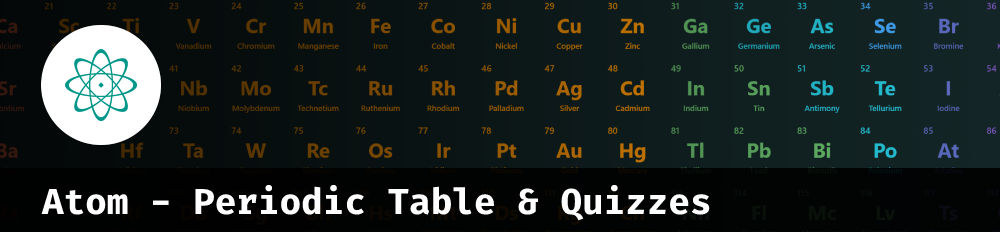

# 

[![Netlify Status][netlify-badge]][netlify]
[![Code Coverage][coverage-badge]][coverage]
[![Crowdin][crowdin-badge]][crowdin]
[![Github All Contributors][all-contributors-badge]](#contributors)
[![License][license-badge]][license]

## About

Atom is a Progressive Web App to help students learn about periodic table elements' properties.

## Tools

- Quizzes
- Periodic Table
- Mass Calculator

### Quizzes

- Valences Quiz
- Periodic Table Quiz

## Technologies used

- [React](https://reactjs.org/)
- [Typescript](https://www.typescriptlang.org/)
- [SASS](https://sass-lang.com/)
- [Vite](https://vitejs.dev/)
- [more in package.json](./package.json)

## How to run

It would be best if you had Node.js and Yarn 1 to run this project.

- Install all dependencies

```
yarn
```

- Launch a dev server listening in https://localhost:8888/

```
yarn dev
```

- Build for production

```
yarn build
```

## Sponsored by

<!-- SENTRY -->

<a href="https://sentry.io" aria-label="Sentry">
  
</a>

## Credits

We took the Crowdin workflow from the [Excalidraw Project](https://github.com/excalidraw/excalidraw/tree/master/src/locales).

## Contributors ✨

Thanks goes to these wonderful people ([emoji key](https://allcontributors.org/docs/en/emoji-key)):

<!-- ALL-CONTRIBUTORS-LIST:START - Do not remove or modify this section -->
<!-- prettier-ignore-start -->
<!-- markdownlint-disable -->
<table>
  <tr>
    <td align="center"><a href="https://horus.dev"><br /><sub><b>Horus Lugo</b></sub></a><br /><a href="#maintenance-HorusGoul" title="Maintenance">🚧</a> <a href="#ideas-HorusGoul" title="Ideas, Planning, & Feedback">🤔</a> <a href="https://github.com/HorusGoul/atom-pwa/commits?author=HorusGoul" title="Code">💻</a> <a href="#design-HorusGoul" title="Design">🎨</a> <a href="https://github.com/HorusGoul/atom-pwa/pulls?q=is%3Apr+reviewed-by%3AHorusGoul" title="Reviewed Pull Requests">👀</a> <a href="#infra-HorusGoul" title="Infrastructure (Hosting, Build-Tools, etc)">🚇</a> <a href="#translation-HorusGoul" title="Translation">🌍</a></td>
    <td align="center"><a href="http://silas229.me"><br /><sub><b>Silas Meyer</b></sub></a><br /><a href="#translation-silas229" title="Translation">🌍</a></td>
    <td align="center"><a href="https://github.com/alexprave"><br /><sub><b>alexprave</b></sub></a><br /><a href="#translation-alexprave" title="Translation">🌍</a></td>
  </tr>
</table>

<!-- markdownlint-restore -->
<!-- prettier-ignore-end -->

<!-- ALL-CONTRIBUTORS-LIST:END -->

This project follows the [all-contributors](https://github.com/all-contributors/all-contributors) specification. Contributions of any kind welcome!

<!-- prettier-ignore-start -->
[all-contributors-badge]: https://img.shields.io/github/all-contributors/HorusGoul/atom-pwa/next
[coverage-badge]: https://img.shields.io/codecov/c/github/HorusGoul/atom-pwa.svg?style=flat-square
[coverage]: https://codecov.io/github/HorusGoul/atom-pwa
[crowdin-badge]: https://badges.crowdin.net/atom-periodic-table-quizzes/localized.svg
[crowdin]: https://crowdin.com/project/atom-periodic-table-quizzes
[license-badge]: https://img.shields.io/github/license/horusgoul/atom-pwa
[license]: ./LICENSE
[netlify-badge]: https://api.netlify.com/api/v1/badges/b7b84fd9-7d85-4094-b989-e74824fb3233/deploy-status
[netlify]: https://app.netlify.com/sites/atom-pt/deploys
<!-- prettier-ignore-end -->
